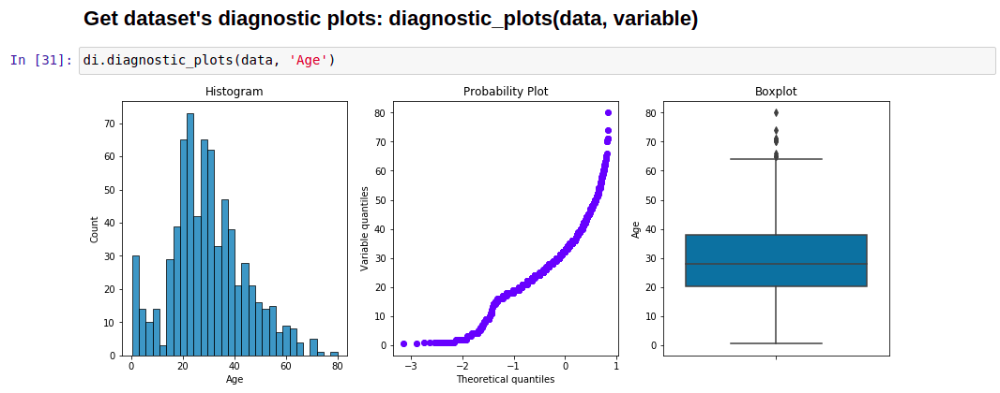
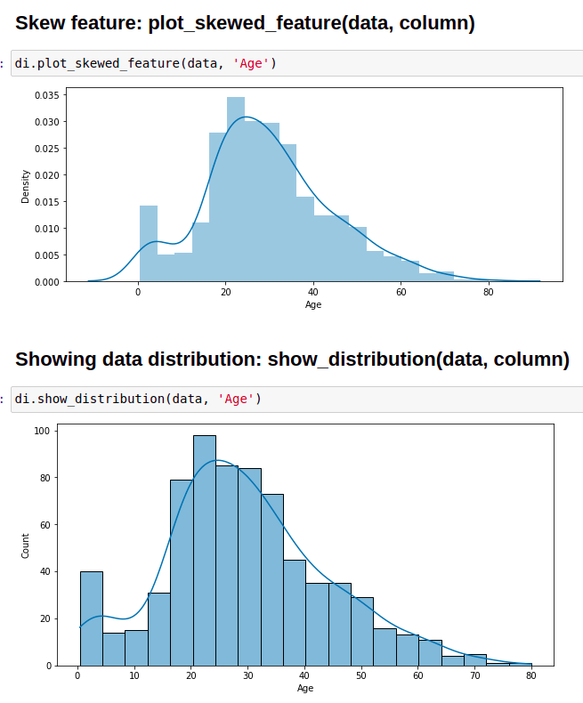
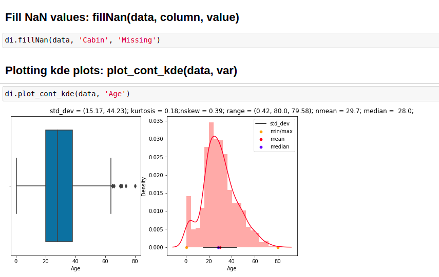

# Data Inspector 
## This python library brings different functions to make EDA, data cleaning easier. 
### Author: Kazi Amit Hasan


## Project Description: 

Data Inspector brings a total of 15 essential exploratory data analysis, data cleaning automations to make a dataset understandable. This is a perfect tool to get started with you data.

[](https://pepy.tech/project/data-inspector)

## Installation

```pip install data-inspector```

Package available at https://pypi.org/project/data-inspector/


### Available automation:


1. Line plot : ```line_plot(data, x_data, y_data, x_label="", y_label="", title="")```
2. Skew feature: ```plot_skewed_feature(data, column)```
3. Showing data distribution: ```show_distribution(data, column)```
4. Scatter plot: ```plot_scatter(data,x_data, y_data)```
5. Correlation plot: ```plot_correlation(data)```
6. Create histogram: ```histogram(data,column, x_label, y_label, title)```
7. Create bar plot: ```plot_bar(data, column, xlabel, ylabel, title)```
8. Create boxplots of all features: ```box_plot(data)```
9. Checking dataset's shape: ```datasetShape(data)```
10. Get dataset's diagnostic plots: ```diagnostic_plots(data, variable)```
11. Divide numerical and categorical features: ```divideFeatures(data)```
12. Fill NaN values: ```fillNan(data, column, value)```
13. Get pearson's correlation between two variables: ```get_correlation(column_1, column_2, data)```
14. Plotting kde plots:``` plot_cont_kde(data, var)``` 
15. Automatic calculating the missing values and their percentage along with visualization : ```calculating_missing_values(data)```


### Tutorial: 
Link: https://github.com/AmitHasanShuvo/data-inspector/blob/main/notebook/example%20notebook.ipynb 
<br>
Colab link: https://colab.research.google.com/drive/1mj9gz2XyQprSYdKMUKlKkJ9Qi8XmleHW?usp=sharing


### Some visualizations



<br>

<br>



